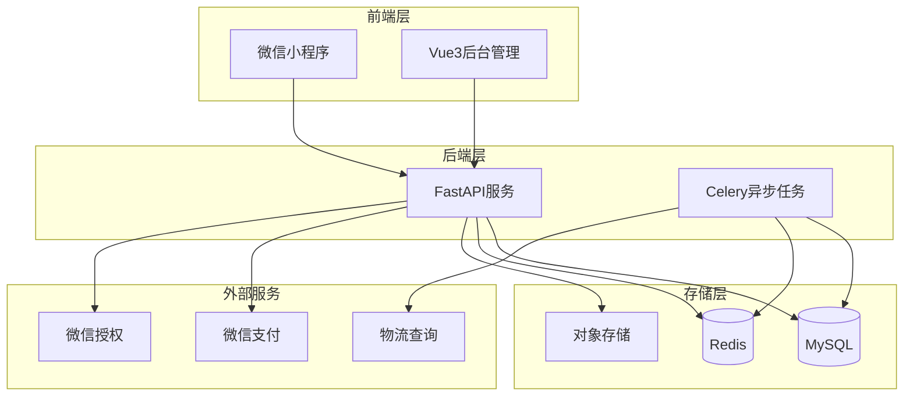
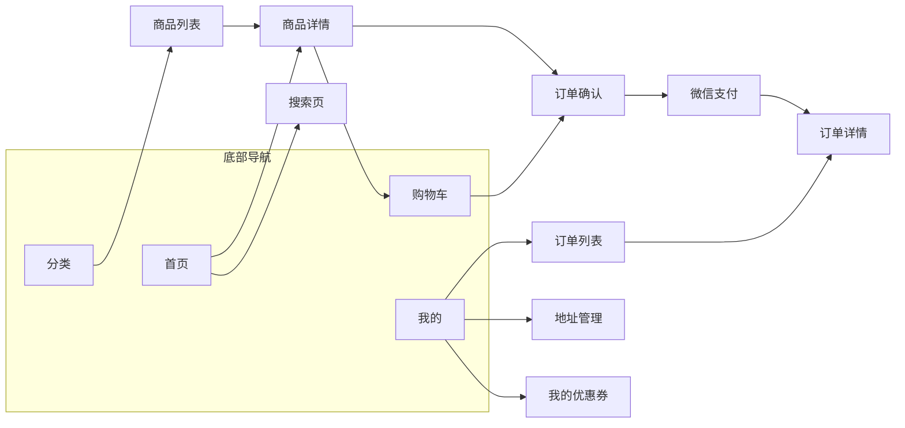
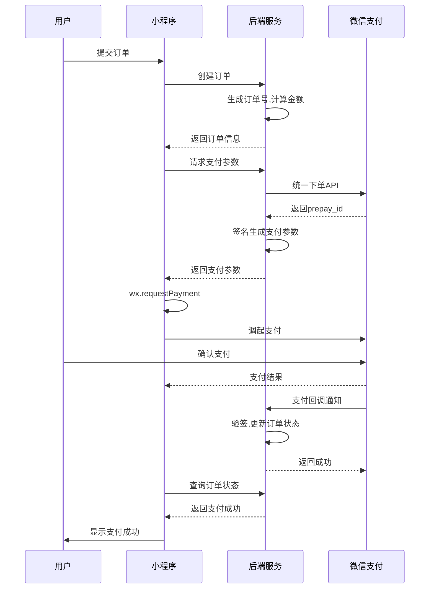
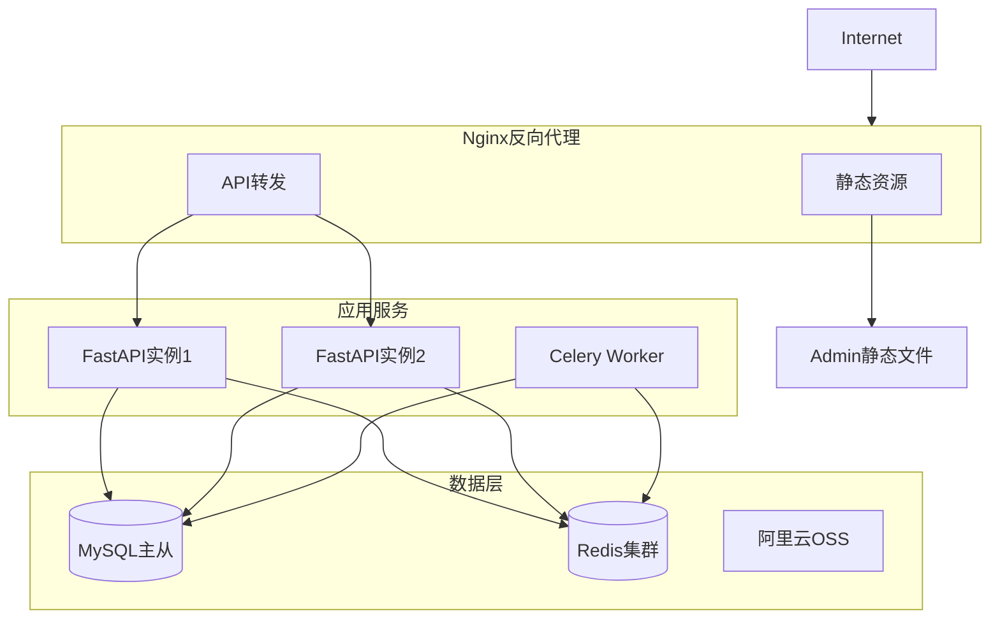

# 微信商城小程序系统设计规划

## 一、项目结构

```
mall-system/
├── miniprogram/          # 微信小程序前端
├── admin/                # Vue3 后台管理系统
├── backend/              # FastAPI 后端服务
├── docs/                 # 项目文档
└── docker-compose.yml    # Docker 部署配置
```

---

## 二、技术架构



---

## 三、数据库设计

### 3.1 用户模块

```sql
-- 用户表
CREATE TABLE users (
    id BIGINT PRIMARY KEY AUTO_INCREMENT,
    openid VARCHAR(64) UNIQUE NOT NULL COMMENT '微信openid',
    unionid VARCHAR(64) COMMENT '微信unionid',
    nickname VARCHAR(64) COMMENT '昵称',
    avatar VARCHAR(255) COMMENT '头像',
    phone VARCHAR(20) COMMENT '手机号',
    gender TINYINT DEFAULT 0 COMMENT '性别 0未知 1男 2女',
    balance DECIMAL(10,2) DEFAULT 0.00 COMMENT '余额',
    points INT DEFAULT 0 COMMENT '积分',
    status TINYINT DEFAULT 1 COMMENT '状态 0禁用 1正常',
    created_at DATETIME DEFAULT CURRENT_TIMESTAMP,
    updated_at DATETIME DEFAULT CURRENT_TIMESTAMP ON UPDATE CURRENT_TIMESTAMP,
    INDEX idx_openid (openid),
    INDEX idx_phone (phone)
);

-- 用户收货地址表
CREATE TABLE user_addresses (
    id BIGINT PRIMARY KEY AUTO_INCREMENT,
    user_id BIGINT NOT NULL,
    name VARCHAR(32) NOT NULL COMMENT '收货人',
    phone VARCHAR(20) NOT NULL COMMENT '联系电话',
    province VARCHAR(32) NOT NULL COMMENT '省',
    city VARCHAR(32) NOT NULL COMMENT '市',
    district VARCHAR(32) NOT NULL COMMENT '区',
    detail VARCHAR(255) NOT NULL COMMENT '详细地址',
    is_default TINYINT DEFAULT 0 COMMENT '是否默认',
    created_at DATETIME DEFAULT CURRENT_TIMESTAMP,
    INDEX idx_user_id (user_id)
);
```

### 3.2 商品模块

```sql
-- 商品分类表
CREATE TABLE categories (
    id BIGINT PRIMARY KEY AUTO_INCREMENT,
    parent_id BIGINT DEFAULT 0 COMMENT '父分类ID',
    name VARCHAR(64) NOT NULL COMMENT '分类名称',
    icon VARCHAR(255) COMMENT '分类图标',
    sort INT DEFAULT 0 COMMENT '排序',
    status TINYINT DEFAULT 1 COMMENT '状态',
    created_at DATETIME DEFAULT CURRENT_TIMESTAMP
);

-- 商品表
CREATE TABLE products (
    id BIGINT PRIMARY KEY AUTO_INCREMENT,
    category_id BIGINT NOT NULL COMMENT '分类ID',
    name VARCHAR(128) NOT NULL COMMENT '商品名称',
    subtitle VARCHAR(255) COMMENT '副标题',
    cover VARCHAR(255) COMMENT '封面图',
    images JSON COMMENT '商品图片',
    description TEXT COMMENT '商品描述',
    price DECIMAL(10,2) NOT NULL COMMENT '销售价',
    original_price DECIMAL(10,2) COMMENT '原价',
    stock INT DEFAULT 0 COMMENT '库存',
    sales INT DEFAULT 0 COMMENT '销量',
    status TINYINT DEFAULT 1 COMMENT '状态 0下架 1上架',
    is_hot TINYINT DEFAULT 0 COMMENT '是否热门',
    is_new TINYINT DEFAULT 0 COMMENT '是否新品',
    sort INT DEFAULT 0 COMMENT '排序',
    created_at DATETIME DEFAULT CURRENT_TIMESTAMP,
    updated_at DATETIME DEFAULT CURRENT_TIMESTAMP ON UPDATE CURRENT_TIMESTAMP,
    INDEX idx_category (category_id),
    INDEX idx_status (status)
);

-- 商品SKU表
CREATE TABLE product_skus (
    id BIGINT PRIMARY KEY AUTO_INCREMENT,
    product_id BIGINT NOT NULL,
    sku_code VARCHAR(64) COMMENT 'SKU编码',
    specs JSON COMMENT '规格 {"颜色":"红色","尺寸":"XL"}',
    price DECIMAL(10,2) NOT NULL COMMENT '价格',
    stock INT DEFAULT 0 COMMENT '库存',
    image VARCHAR(255) COMMENT 'SKU图片',
    created_at DATETIME DEFAULT CURRENT_TIMESTAMP,
    INDEX idx_product (product_id)
);
```

### 3.3 订单模块

```sql
-- 订单表
CREATE TABLE orders (
    id BIGINT PRIMARY KEY AUTO_INCREMENT,
    order_no VARCHAR(32) UNIQUE NOT NULL COMMENT '订单号',
    user_id BIGINT NOT NULL,
    total_amount DECIMAL(10,2) NOT NULL COMMENT '订单总额',
    pay_amount DECIMAL(10,2) NOT NULL COMMENT '实付金额',
    freight_amount DECIMAL(10,2) DEFAULT 0.00 COMMENT '运费',
    discount_amount DECIMAL(10,2) DEFAULT 0.00 COMMENT '优惠金额',
    coupon_id BIGINT COMMENT '优惠券ID',
    status TINYINT DEFAULT 0 COMMENT '状态 0待付款 1待发货 2待收货 3已完成 4已取消 5已退款',
    pay_time DATETIME COMMENT '支付时间',
    pay_type TINYINT COMMENT '支付方式 1微信支付',
    transaction_id VARCHAR(64) COMMENT '微信支付流水号',
    ship_time DATETIME COMMENT '发货时间',
    receive_time DATETIME COMMENT '收货时间',
    address_snapshot JSON COMMENT '收货地址快照',
    remark VARCHAR(255) COMMENT '订单备注',
    created_at DATETIME DEFAULT CURRENT_TIMESTAMP,
    updated_at DATETIME DEFAULT CURRENT_TIMESTAMP ON UPDATE CURRENT_TIMESTAMP,
    INDEX idx_user (user_id),
    INDEX idx_order_no (order_no),
    INDEX idx_status (status),
    INDEX idx_created (created_at)
);

-- 订单商品表
CREATE TABLE order_items (
    id BIGINT PRIMARY KEY AUTO_INCREMENT,
    order_id BIGINT NOT NULL,
    product_id BIGINT NOT NULL,
    sku_id BIGINT COMMENT 'SKU ID',
    product_name VARCHAR(128) NOT NULL COMMENT '商品名称',
    product_image VARCHAR(255) COMMENT '商品图片',
    specs VARCHAR(255) COMMENT '规格',
    price DECIMAL(10,2) NOT NULL COMMENT '单价',
    quantity INT NOT NULL COMMENT '数量',
    created_at DATETIME DEFAULT CURRENT_TIMESTAMP,
    INDEX idx_order (order_id)
);

-- 物流信息表
CREATE TABLE order_logistics (
    id BIGINT PRIMARY KEY AUTO_INCREMENT,
    order_id BIGINT NOT NULL,
    company VARCHAR(32) COMMENT '物流公司',
    tracking_no VARCHAR(64) COMMENT '物流单号',
    traces JSON COMMENT '物流轨迹',
    created_at DATETIME DEFAULT CURRENT_TIMESTAMP,
    updated_at DATETIME DEFAULT CURRENT_TIMESTAMP ON UPDATE CURRENT_TIMESTAMP,
    INDEX idx_order (order_id)
);
```

### 3.4 营销模块

```sql
-- 优惠券模板表
CREATE TABLE coupon_templates (
    id BIGINT PRIMARY KEY AUTO_INCREMENT,
    name VARCHAR(64) NOT NULL COMMENT '优惠券名称',
    type TINYINT NOT NULL COMMENT '类型 1满减 2折扣 3无门槛',
    value DECIMAL(10,2) NOT NULL COMMENT '优惠值',
    min_amount DECIMAL(10,2) DEFAULT 0 COMMENT '最低消费',
    total_count INT NOT NULL COMMENT '发放总量',
    remain_count INT NOT NULL COMMENT '剩余数量',
    per_limit INT DEFAULT 1 COMMENT '每人限领',
    start_time DATETIME COMMENT '开始时间',
    end_time DATETIME COMMENT '结束时间',
    status TINYINT DEFAULT 1 COMMENT '状态',
    created_at DATETIME DEFAULT CURRENT_TIMESTAMP
);

-- 用户优惠券表
CREATE TABLE user_coupons (
    id BIGINT PRIMARY KEY AUTO_INCREMENT,
    user_id BIGINT NOT NULL,
    coupon_id BIGINT NOT NULL,
    status TINYINT DEFAULT 0 COMMENT '状态 0未使用 1已使用 2已过期',
    used_time DATETIME COMMENT '使用时间',
    order_id BIGINT COMMENT '使用订单',
    expire_time DATETIME NOT NULL COMMENT '过期时间',
    created_at DATETIME DEFAULT CURRENT_TIMESTAMP,
    INDEX idx_user (user_id),
    INDEX idx_status (status)
);
```

### 3.5 购物车与系统模块

```sql
-- 购物车表
CREATE TABLE carts (
    id BIGINT PRIMARY KEY AUTO_INCREMENT,
    user_id BIGINT NOT NULL,
    product_id BIGINT NOT NULL,
    sku_id BIGINT COMMENT 'SKU ID',
    quantity INT NOT NULL DEFAULT 1 COMMENT '数量',
    selected TINYINT DEFAULT 1 COMMENT '是否选中',
    created_at DATETIME DEFAULT CURRENT_TIMESTAMP,
    updated_at DATETIME DEFAULT CURRENT_TIMESTAMP ON UPDATE CURRENT_TIMESTAMP,
    UNIQUE KEY uk_user_sku (user_id, product_id, sku_id)
);

-- 后台管理员表
CREATE TABLE admins (
    id BIGINT PRIMARY KEY AUTO_INCREMENT,
    username VARCHAR(32) UNIQUE NOT NULL,
    password VARCHAR(128) NOT NULL,
    nickname VARCHAR(64),
    avatar VARCHAR(255),
    role VARCHAR(32) DEFAULT 'admin' COMMENT '角色',
    status TINYINT DEFAULT 1,
    last_login DATETIME,
    created_at DATETIME DEFAULT CURRENT_TIMESTAMP
);

-- 系统配置表
CREATE TABLE system_configs (
    id BIGINT PRIMARY KEY AUTO_INCREMENT,
    config_key VARCHAR(64) UNIQUE NOT NULL,
    config_value TEXT,
    remark VARCHAR(255),
    created_at DATETIME DEFAULT CURRENT_TIMESTAMP
);

-- 轮播图表
CREATE TABLE banners (
    id BIGINT PRIMARY KEY AUTO_INCREMENT,
    title VARCHAR(64),
    image VARCHAR(255) NOT NULL,
    link_type TINYINT COMMENT '链接类型 1商品 2分类 3页面 4外链',
    link_value VARCHAR(255) COMMENT '链接值',
    sort INT DEFAULT 0,
    status TINYINT DEFAULT 1,
    created_at DATETIME DEFAULT CURRENT_TIMESTAMP
);
```

---

## 四、后端 API 设计 (FastAPI)

### 4.1 项目结构

```
backend/
├── app/
│   ├── __init__.py
│   ├── main.py                 # 应用入口
│   ├── core/
│   │   ├── config.py           # 配置
│   │   ├── security.py         # 安全/JWT
│   │   ├── deps.py             # 依赖注入
│   │   └── exceptions.py       # 异常处理
│   ├── api/
│   │   ├── v1/
│   │   │   ├── auth.py         # 认证
│   │   │   ├── user.py         # 用户
│   │   │   ├── product.py      # 商品
│   │   │   ├── cart.py         # 购物车
│   │   │   ├── order.py        # 订单
│   │   │   ├── payment.py      # 支付
│   │   │   ├── coupon.py       # 优惠券
│   │   │   └── common.py       # 公共接口
│   │   └── admin/
│   │       ├── auth.py         # 后台认证
│   │       ├── product.py      # 商品管理
│   │       ├── order.py        # 订单管理
│   │       ├── user.py         # 用户管理
│   │       ├── coupon.py       # 优惠券管理
│   │       ├── statistics.py   # 数据统计
│   │       └── system.py       # 系统设置
│   ├── models/                 # SQLAlchemy 模型
│   ├── schemas/                # Pydantic 模式
│   ├── services/               # 业务逻辑
│   ├── utils/
│   │   ├── wechat.py           # 微信API封装
│   │   └── sms.py              # 短信服务
│   └── tasks/                  # Celery 异步任务
├── alembic/                    # 数据库迁移
├── requirements.txt
└── Dockerfile
```

### 4.2 核心 API 接口

#### 小程序端接口

| 模块   | 接口                          | 方法     | 描述          |
| ------ | ----------------------------- | -------- | ------------- |
| 认证   | `/api/v1/auth/login`          | POST     | 微信登录      |
| 认证   | `/api/v1/auth/phone`          | POST     | 获取手机号    |
| 用户   | `/api/v1/user/profile`        | GET/PUT  | 用户信息      |
| 用户   | `/api/v1/user/addresses`      | CRUD     | 收货地址      |
| 商品   | `/api/v1/products`            | GET      | 商品列表      |
| 商品   | `/api/v1/products/{id}`       | GET      | 商品详情      |
| 商品   | `/api/v1/categories`          | GET      | 分类列表      |
| 购物车 | `/api/v1/cart`                | CRUD     | 购物车操作    |
| 订单   | `/api/v1/orders`              | GET/POST | 订单列表/创建 |
| 订单   | `/api/v1/orders/{id}`         | GET      | 订单详情      |
| 订单   | `/api/v1/orders/{id}/cancel`  | POST     | 取消订单      |
| 订单   | `/api/v1/orders/{id}/confirm` | POST     | 确认收货      |
| 支付   | `/api/v1/payment/prepay`      | POST     | 发起支付      |
| 支付   | `/api/v1/payment/notify`      | POST     | 支付回调      |
| 优惠券 | `/api/v1/coupons`             | GET      | 可领优惠券    |
| 优惠券 | `/api/v1/coupons/receive`     | POST     | 领取优惠券    |
| 优惠券 | `/api/v1/user/coupons`        | GET      | 我的优惠券    |
| 公共   | `/api/v1/banners`             | GET      | 轮播图        |
| 公共   | `/api/v1/upload`              | POST     | 文件上传      |

#### 管理端接口

| 模块   | 接口                             | 方法    | 描述       |
| ------ | -------------------------------- | ------- | ---------- |
| 认证   | `/api/admin/login`               | POST    | 管理员登录 |
| 商品   | `/api/admin/products`            | CRUD    | 商品管理   |
| 分类   | `/api/admin/categories`          | CRUD    | 分类管理   |
| 订单   | `/api/admin/orders`              | GET/PUT | 订单管理   |
| 订单   | `/api/admin/orders/{id}/ship`    | POST    | 发货       |
| 用户   | `/api/admin/users`               | GET/PUT | 用户管理   |
| 优惠券 | `/api/admin/coupons`             | CRUD    | 优惠券管理 |
| 统计   | `/api/admin/statistics/overview` | GET     | 数据概览   |
| 统计   | `/api/admin/statistics/sales`    | GET     | 销售统计   |
| 系统   | `/api/admin/banners`             | CRUD    | 轮播图管理 |
| 系统   | `/api/admin/configs`             | GET/PUT | 系统配置   |

---

## 五、微信小程序端设计

### 5.1 项目结构

```
miniprogram/
├── pages/
│   ├── index/              # 首页
│   ├── category/           # 分类
│   ├── cart/               # 购物车
│   ├── user/               # 我的
│   ├── product/            # 商品详情
│   ├── order/
│   │   ├── confirm/        # 订单确认
│   │   ├── list/           # 订单列表
│   │   └── detail/         # 订单详情
│   ├── address/
│   │   ├── list/           # 地址列表
│   │   └── edit/           # 地址编辑
│   ├── coupon/             # 优惠券
│   └── search/             # 搜索
├── components/             # 公共组件
├── utils/
│   ├── request.js          # 请求封装
│   ├── auth.js             # 认证
│   └── util.js             # 工具函数
├── store/                  # 状态管理
├── static/                 # 静态资源
├── app.js
├── app.json
└── app.wxss
```

### 5.2 页面功能



---

## 六、Vue3 后台管理系统设计

### 6.1 技术栈

- Vue 3 + TypeScript
- Vite (构建工具)
- Element Plus (UI组件库)
- Pinia (状态管理)
- Vue Router
- Axios
- ECharts (图表)

### 6.2 项目结构

```
admin/
├── src/
│   ├── api/                # API 接口
│   ├── assets/             # 静态资源
│   ├── components/         # 公共组件
│   ├── composables/        # 组合函数
│   ├── layout/             # 布局组件
│   ├── router/             # 路由配置
│   ├── store/              # Pinia 状态
│   ├── styles/             # 样式
│   ├── utils/              # 工具函数
│   ├── views/
│   │   ├── dashboard/      # 控制台
│   │   ├── product/        # 商品管理
│   │   ├── order/          # 订单管理
│   │   ├── user/           # 用户管理
│   │   ├── marketing/      # 营销管理
│   │   ├── system/         # 系统设置
│   │   └── login/          # 登录
│   ├── App.vue
│   └── main.ts
├── index.html
├── vite.config.ts
├── tsconfig.json
└── package.json
```

### 6.3 功能模块

- **控制台**: 数据概览、销售统计图表、待处理事项
- **商品管理**: 商品列表、添加/编辑商品、分类管理、库存管理
- **订单管理**: 订单列表、订单详情、发货处理、退款处理
- **用户管理**: 用户列表、用户详情
- **营销管理**: 优惠券管理、发放记录
- **系统设置**: 轮播图管理、系统配置、管理员管理

---

## 七、微信支付流程



---

## 八、Redis 缓存设计

| Key 格式                         | 数据类型 | 用途               | 过期时间 |
| -------------------------------- | -------- | ------------------ | -------- |
| `user:token:{openid}`            | String   | 用户登录Token      | 7天      |
| `product:detail:{id}`            | Hash     | 商品详情缓存       | 1小时    |
| `product:list:{category}:{page}` | String   | 商品列表缓存       | 10分钟   |
| `cart:{user_id}`                 | Hash     | 购物车数据         | 持久化   |
| `order:lock:{order_no}`          | String   | 订单锁(防重复支付) | 5分钟    |
| `stock:lock:{sku_id}`            | String   | 库存锁             | 30秒     |
| `hot:products`                   | ZSet     | 热门商品排行       | 1小时    |
| `coupon:remain:{id}`             | String   | 优惠券剩余数量     | 持久化   |

---

## 九、关键依赖

### 后端 (requirements.txt)

```
fastapi==0.109.0
uvicorn[standard]==0.27.0
sqlalchemy==2.0.25
alembic==1.13.1
pymysql==1.1.0
redis==5.0.1
pydantic==2.5.3
python-jose[cryptography]==3.3.0
passlib[bcrypt]==1.7.4
celery==5.3.6
httpx==0.26.0
python-multipart==0.0.6
wechatpayv3==1.2.35
```

### 前端 Admin (package.json)

```json
{
  "dependencies": {
    "vue": "^3.4.0",
    "vue-router": "^4.2.5",
    "pinia": "^2.1.7",
    "element-plus": "^2.5.0",
    "axios": "^1.6.5",
    "echarts": "^5.4.3",
    "@vueuse/core": "^10.7.0"
  },
  "devDependencies": {
    "vite": "^5.0.10",
    "typescript": "^5.3.3",
    "@vitejs/plugin-vue": "^5.0.0"
  }
}
```

---

## 十、部署架构



---

## 十一、开发任务清单

### 后端开发任务

1. 初始化 FastAPI 项目结构，配置数据库连接和 Redis
2. 创建 SQLAlchemy 数据模型和数据库迁移脚本
3. 实现微信登录认证和 JWT Token 管理
4. 开发商品模块 API（分类、商品、SKU）
5. 开发购物车模块 API
6. 开发订单模块 API（创建、查询、状态管理）
7. 集成微信支付（统一下单、支付回调）
8. 开发优惠券模块 API
9. 开发后台管理 API 接口

### 前端开发任务

10. 开发微信小程序前端
11. 开发 Vue3 后台管理系统

### 部署任务

12. 编写 Docker 部署配置

---

## 十二、注意事项

### 安全相关

- 所有敏感配置（微信密钥、数据库密码等）使用环境变量
- API 接口需要做好权限验证
- 支付回调需要验证签名
- 防止 SQL 注入和 XSS 攻击

### 性能相关

- 商品列表和详情使用 Redis 缓存
- 库存扣减使用 Redis + 数据库双写
- 订单超时取消使用延迟队列
- 图片使用 CDN 加速

### 微信小程序相关

- 需要在微信公众平台注册小程序并获取 AppID 和 AppSecret
- 需要开通微信支付商户号
- 上线前需要进行小程序审核